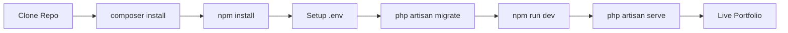

<div align="center">

# 🚀 Personal Portfolio Laravel Template

*Full-stack Laravel portfolio with Tailwind CSS, Vite, and modern web technologies*

[](https://github.com/MrShadowRIFAT/URQ597N-Personal_Portfolio_Laravel_Template)


**Full-stack. Powerful. Production-ready.**

</div>

---

## ✨ Why This Project

Build a professional portfolio with Laravel's robust backend capabilities. Includes database support, admin panel ready, API capabilities, and modern frontend with Tailwind CSS. Perfect for developers and creative professionals.

---

## 🔥 Features

🔒 **Laravel Backend** – Powerful full-stack framework  
💾 **Database Ready** – Eloquent ORM included  
🎨 **Tailwind CSS** – Modern utility-first styling  
⚡ **Vite** – Lightning-fast development & build  
📱 **Responsive Design** – Mobile-first approach  
🔐 **Built-in Auth** – User authentication ready  
📧 **Email Support** – Contact form integration  
🚀 **API Ready** – REST API capabilities  

---

## 🚀 Installation

### Prerequisites
```
PHP 8.1+
Composer
Node.js 16+
MySQL/PostgreSQL
```

### 1️⃣ Clone & Setup
```bash
git clone https://github.com/YOUR_USERNAME/URQ597N-Personal_Portfolio_Laravel_Template.git
cd URQ597N-Personal_Portfolio_Laravel_Template
composer install
npm install
```

### 2️⃣ Environment Setup
```bash
cp .env.example .env
php artisan key:generate
php artisan migrate
```

### 3️⃣ Run Locally
```bash
# Terminal 1: Start Laravel server
php artisan serve

# Terminal 2: Start Vite dev server
npm run dev

# Open http://localhost:8000
```

---

## 📁 Project Structure

| Folder | Purpose |
|--------|---------|
| `app/` | Laravel models, controllers, logic |
| `routes/` | API & web routes |
| `resources/` | Blade templates & Vue components |
| `database/` | Migrations & seeders |
| `config/` | Application configuration |
| `storage/` | File uploads & logs |
| `tests/` | Application tests |
| `public/` | Web-accessible files |

---

## 🧠 How It Works



---

## 🛠️ Tech Stack

<div align="center">


</div>

**Laravel 11** • **PHP 8.1+** • **Tailwind CSS** • **Vite** • **MySQL** • **Vue/Blade** • **Axios**

---

## 💻 Available Commands

```bash
# Development
npm run dev              # Start Vite dev server
php artisan serve       # Start Laravel server

# Production
npm run build           # Build for production
php artisan migrate     # Run migrations
php artisan optimize    # Optimize for production

# Testing
php artisan test        # Run tests
php artisan tinker      # Interactive shell
```

---

## 📝 Key Features

**Portfolio Pages** – Project showcase  
**Admin Dashboard** – Content management  
**Contact Form** – Lead capture with validation  
**Database Integration** – Store projects & messages  
**Email Notifications** – Contact alerts  
**Authentication** – User login/register  
**API Routes** – REST API for frontend  
**Migrations** – Database versioning  

---

## 🎯 Setup Steps

1. **Clone Repository** – Get the code
2. **Install Dependencies** – `composer install` & `npm install`
3. **Create Database** – MySQL/PostgreSQL database
4. **Configure .env** – Database credentials, app key
5. **Run Migrations** – `php artisan migrate`
6. **Start Servers** – Vite + Laravel
7. **Customize** – Add your portfolio content

---

## 📦 Database Setup

```bash
# Create database migration
php artisan make:model Project -m

# Run migrations
php artisan migrate

# Rollback (if needed)
php artisan migrate:rollback
```

---

## 🔐 Authentication

```bash
# Install Laravel Breeze (optional)
composer require laravel/breeze --dev
php artisan breeze:install

# Or use built-in auth scaffolding
php artisan ui bootstrap --auth
```

---

## 📧 Email Configuration

Update `.env`:
```
MAIL_DRIVER=smtp
MAIL_HOST=smtp.mailtrap.io
MAIL_PORT=587
MAIL_USERNAME=your_username
MAIL_PASSWORD=your_password
MAIL_FROM_ADDRESS=from@example.com
```

---

## 🚀 Deployment

**Recommended Platforms:**
- **Laravel Forge** – Premium managed hosting
- **Heroku** – Easy PaaS deployment
- **DigitalOcean** – VPS with full control
- **Shared Hosting** – Traditional hosting
- **AWS** – Enterprise solutions

---

## 📊 GitHub Stats

<div align="center">


</div>

---

## 🎯 Customization

1. **Edit Blade Templates** – `resources/views/`
2. **Modify Controllers** – `app/Http/Controllers/`
3. **Update Routes** – `routes/web.php` & `routes/api.php`
4. **Customize Styles** – Tailwind in `resources/css/`
5. **Add Models** – Create via `php artisan make:model`
6. **Configure Mail** – Update `.env` for emails

---

## 📚 Laravel Resources

- [Laravel Documentation](https://laravel.com/docs)
- [Tailwind CSS Docs](https://tailwindcss.com/docs)
- [Vite Guide](https://vitejs.dev/guide/)
- [Laravel Bootcamp](https://bootcamp.laravel.com)

---

## 👨‍💼 Author

**MrShadowRIFAT** | [🔗 rifat.website](https://rifat.website) | [📧 noreply@rifat.website](mailto:noreply@rifat.website)

---

<div align="center">

**[⭐ Star This Repo](#)** • **[🐛 Report Issue](#)** • **[💡 Suggest Feature](#)**

Made with ❤️ for full-stack developers

</div>

## Laravel Sponsors

We would like to extend our thanks to the following sponsors for funding Laravel development. If you are interested in becoming a sponsor, please visit the [Laravel Partners program](https://partners.laravel.com).

### Premium Partners

- **[Vehikl](https://vehikl.com/)**
- **[Tighten Co.](https://tighten.co)**
- **[WebReinvent](https://webreinvent.com/)**
- **[Kirschbaum Development Group](https://kirschbaumdevelopment.com)**
- **[64 Robots](https://64robots.com)**
- **[Curotec](https://www.curotec.com/services/technologies/laravel/)**
- **[Cyber-Duck](https://cyber-duck.co.uk)**
- **[DevSquad](https://devsquad.com/hire-laravel-developers)**
- **[Jump24](https://jump24.co.uk)**
- **[Redberry](https://redberry.international/laravel/)**
- **[Active Logic](https://activelogic.com)**
- **[byte5](https://byte5.de)**
- **[OP.GG](https://op.gg)**

## Contributing

Thank you for considering contributing to the Laravel framework! The contribution guide can be found in the [Laravel documentation](https://laravel.com/docs/contributions).

## Code of Conduct

In order to ensure that the Laravel community is welcoming to all, please review and abide by the [Code of Conduct](https://laravel.com/docs/contributions#code-of-conduct).

## Security Vulnerabilities

If you discover a security vulnerability within Laravel, please send an e-mail to Taylor Otwell via [taylor@laravel.com](mailto:taylor@laravel.com). All security vulnerabilities will be promptly addressed.

## License

The Laravel framework is open-sourced software licensed under the [MIT license](https://opensource.org/licenses/MIT).
